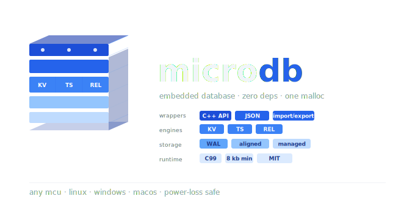

# microdb

> Embedded database for microcontrollers.
> Three engines. One malloc. Zero dependencies.
> Deterministic durable storage core for MCU/embedded systems.

[](https://github.com/Vanderhell/microdb/actions/workflows/ci.yml)
[](https://en.wikipedia.org/wiki/C99)
[](LICENSE)
[](https://github.com/Vanderhell/microdb)
[](https://github.com/Vanderhell/microdb/actions/workflows/ci.yml)
[](https://github.com/Vanderhell/microdb/releases)
[](https://github.com/Vanderhell/microdb/wiki)
[](CONTRIBUTING.md)
[](SECURITY.md)

## What is microdb?

microdb is a compact embedded database written in C99 for firmware and small edge runtimes.
It combines three storage models behind one API surface:

- KV for configuration, caches, and TTL-backed state
- Time-series for sensor samples and rolling telemetry
- Relational for small indexed tables

The library allocates exactly once in `microdb_init()`, runs without external dependencies,
and can operate either in RAM-only mode or with a storage HAL for persistence and WAL recovery.

## Product Contract

- Positioning: see [PRODUCT_POSITIONING.md](docs/PRODUCT_POSITIONING.md)
- Product brief (1 page): see [PRODUCT_BRIEF.md](docs/PRODUCT_BRIEF.md)
- Profile guarantees and limits: see [PROFILE_GUARANTEES.md](docs/PROFILE_GUARANTEES.md)
- Fail-code contract: see [FAIL_CODE_CONTRACT.md](docs/FAIL_CODE_CONTRACT.md)
- Runtime error text helper: `microdb_err_to_string(microdb_err_t)`
- Offline verifier contract: see [OFFLINE_VERIFIER.md](docs/OFFLINE_VERIFIER.md)
- Footprint-min contract: see [FOOTPRINT_MIN_CONTRACT.md](docs/FOOTPRINT_MIN_CONTRACT.md)
- Latest hard verdict: see [hard_verdict_20260412.md](docs/results/hard_verdict_20260412.md)
- Getting started (5 min): see [GETTING_STARTED_5_MIN.md](docs/GETTING_STARTED_5_MIN.md)
- Programmer manual: see [PROGRAMMER_MANUAL.md](docs/PROGRAMMER_MANUAL.md)
- Release checklist: see [RELEASE_CHECKLIST.md](docs/RELEASE_CHECKLIST.md)
- Release tag template: see [RELEASE_TAG_TEMPLATE.md](docs/RELEASE_TAG_TEMPLATE.md)

## Project Governance

- Contribution guide: [CONTRIBUTING.md](CONTRIBUTING.md)
- Changelog: [CHANGELOG.md](CHANGELOG.md)
- Release log: [RELEASE_LOG.md](RELEASE_LOG.md)
- Security policy: [SECURITY.md](SECURITY.md)
- Code of conduct: [CODE_OF_CONDUCT.md](CODE_OF_CONDUCT.md)
- Support policy: [SUPPORT.md](SUPPORT.md)

## Why not SQLite?

SQLite is excellent, but it targets a different operating point.
microdb is intentionally narrower:

- one malloc at init, no allocator churn during normal operation
- fixed RAM budgeting across engines
- tiny integration surface for MCUs and RTOS firmware
- simpler persistence model for flash partitions and file-backed simulation

If you need SQL, dynamic schemas, concurrent access, or large secondary indexes, use SQLite.
If you need predictable memory and embedded-first behavior, microdb is the better fit.

## Quick start

**1. Add to your project:**
```cmake
add_subdirectory(microdb)
target_link_libraries(your_app PRIVATE microdb)
```

**2. Configure and initialize:**
```c
#define MICRODB_RAM_KB 32
#include "microdb.h"

static microdb_t db;

microdb_cfg_t cfg = {
    .storage = NULL,   // RAM-only; provide HAL for persistence
    .now     = NULL,   // provide timestamp fn for TTL support
};
microdb_init(&db, &cfg);
```

## C++ wrapper (incremental)

Header:
- `include/microdb_cpp.hpp`

Current wrapper surface:
- lifecycle: `init/deinit/flush`
- diagnostics: `stats`, `db_stats`, `kv_stats`, `ts_stats`, `rel_stats`, `effective_capacity`, `pressure`
- KV: `kv_set/kv_put/kv_get/kv_del/kv_exists/kv_iter/kv_clear/kv_purge_expired`, `admit_kv_set`
- TS: `ts_register/ts_insert/ts_last/ts_query/ts_query_buf/ts_count/ts_clear`, `admit_ts_insert`
- REL: schema/table helpers + `rel_insert/find/find_by/delete/iter/count/clear`, `admit_rel_insert`
- txn: `txn_begin/txn_commit/txn_rollback`

Minimal example:
```cpp
#include "microdb_cpp.hpp"

microdb::cpp::Database db;
microdb_cfg_t cfg{};
cfg.ram_kb = 32u;
if (db.init(cfg) != MICRODB_OK) { /* handle error */ }

uint8_t v = 7u, out = 0u;
db.kv_put("k", &v, 1u);
db.kv_get("k", &out, 1u);

db.txn_begin();
db.kv_put("k2", &v, 1u);
db.txn_commit();

db.deinit();
```

## Optional wrappers and adapter modules

Core `microdb` is intentionally lean. Extra wrappers/adapters are separate modules and can be toggled in CMake.

Build toggles:
- `MICRODB_BUILD_JSON_WRAPPER` (default `ON`)
- `MICRODB_BUILD_IMPORT_EXPORT` (default `ON`)
- `MICRODB_BUILD_OPTIONAL_BACKENDS` (default `ON`)
- `MICRODB_BUILD_BACKEND_ALIGNED_STUB` / `MICRODB_BUILD_BACKEND_NAND_STUB` / `MICRODB_BUILD_BACKEND_EMMC_STUB` / `MICRODB_BUILD_BACKEND_SD_STUB` / `MICRODB_BUILD_BACKEND_FS_STUB` / `MICRODB_BUILD_BACKEND_BLOCK_STUB`

Wrapper targets:
- `microdb_json_wrapper`
- `microdb_import_export` (links to `microdb_json_wrapper` when available)
- `microdb_backend_registry`
- `microdb_backend_compat`
- `microdb_backend_decision`
- `microdb_backend_aligned_adapter`
- `microdb_backend_managed_adapter`
- `microdb_backend_fs_adapter`
- `microdb_backend_open`

Core contract:
- optional modules are not linked into `microdb` core by default.
- `microdb` must remain independent from optional wrapper/backend targets.

**3. Use all three engines:**
```c
// Key-value
float temp = 23.5f;
microdb_kv_put(&db, "temperature", &temp, sizeof(temp));

// Time-series
microdb_ts_register(&db, "sensor", MICRODB_TS_F32, 0);
microdb_ts_insert(&db, "sensor", time_now(), &temp);

// Relational
microdb_schema_t schema;
microdb_schema_init(&schema, "devices", 32);
microdb_schema_add(&schema, "id",   MICRODB_COL_U16, 2, true);
microdb_schema_add(&schema, "name", MICRODB_COL_STR, 16, false);
microdb_schema_seal(&schema);
microdb_table_create(&db, &schema);
```

## Configuration

Configuration is compile-time first, with a small runtime override surface in `microdb_cfg_t`.

- `MICRODB_RAM_KB` sets the total heap budget
- `MICRODB_RAM_KV_PCT`, `MICRODB_RAM_TS_PCT`, `MICRODB_RAM_REL_PCT` set default engine slices
- `cfg.ram_kb` overrides the total budget per instance
- `cfg.kv_pct`, `cfg.ts_pct`, `cfg.rel_pct` override the slice split per instance
- `MICRODB_ENABLE_WAL` toggles WAL persistence when a storage HAL is present
- `MICRODB_LOG(level, fmt, ...)` enables internal diagnostic logging
- smallest-size variant is available as CMake target `microdb_tiny` (KV-only, TS/REL/WAL disabled, weaker power-fail durability)
- strict smallest **durable** profile is available as `MICRODB_PROFILE_FOOTPRINT_MIN` (KV + WAL + reopen/recovery contract)

Storage budget (separate from RAM budget):
- storage capacity comes from `microdb_storage_t.capacity` (bytes)
- geometry comes from `microdb_storage_t.erase_size` and `microdb_storage_t.write_size`
- current fail-fast storage contract requires `erase_size > 0` and `write_size == 1`
- use `tools/microdb_capacity_estimator.html` for storage/layout planning (`2/4/8/16/32 MiB` profiles)

## KV engine

The KV engine stores short keys with binary values and optional TTL.

- fixed-size hash table with overwrite or reject overflow policy
- LRU eviction for `MICRODB_KV_POLICY_OVERWRITE`
- TTL expiration checked on access
- WAL-backed persistence for set, delete, and clear

## Time-series engine

The time-series engine stores named streams of `F32`, `I32`, `U32`, or raw samples.

- one ring buffer per registered stream
- range queries by timestamp
- overflow policies: drop oldest, reject, or downsample
- WAL-backed persistence for inserts and stream metadata

## Relational engine

The relational engine stores small fixed schemas with packed rows.

- one indexed column per table
- binary-search index on the indexed field
- linear scans for non-index lookups
- insertion-order iteration
- WAL-backed persistence for inserts, deletes, and table metadata

## Storage HAL

microdb supports three storage modes:

- RAM-only: `cfg.storage = NULL`
- POSIX file HAL for tests and simulation
- ESP32 partition HAL via `esp_partition_*`

Persistent layout starts with a WAL region and then separate KV, TS, and REL regions aligned to the storage erase size.

Core storage positioning: microdb core today natively supports byte-write durable backends; aligned/block/NAND media require a translation layer.

Optional backend adapter modules (modular, not linked into core by default):
- `microdb_backend_registry` (adapter registration layer)
- `microdb_backend_compat` (open-time `direct` / `via_adapter` / `unsupported` classification)
- `microdb_backend_aligned_adapter` (RMW byte-write shim for aligned-write media)
- `microdb_backend_managed_adapter` (managed-media adapter skeleton for eMMC/SD/NAND via managed interface)
- `microdb_backend_open` (decision + adapter wiring helper for optional backend flow)
- stub modules for managed media (`nand/emmc/sd`) used for integration/testing flow

Managed adapter contract (fail-fast):
- validates storage hooks and non-zero capacity/erase geometry
- default expectations require byte-write contract and a successful `sync` probe at mount time
- exposes an explicit expectations override API for controlled integration/testing
- managed recovery integration tests cover reopen/power-loss behavior through backend-open wiring
- managed stress test covers mixed KV/TS/REL operations across repeated crash/power-loss reopen cycles
- managed stress is sliced into `smoke` and `long` CTest lanes for faster default validation and deeper fault runs
- both lanes now include explicit runtime envelope gates (`--max-ms`) in addition to CTest timeouts
- lane budgets are calibrated through CMake cache vars: `MICRODB_MANAGED_STRESS_SMOKE_MAX_MS` and `MICRODB_MANAGED_STRESS_LONG_MAX_MS` (see `docs/MANAGED_STRESS_BASELINES.md`)
- CI uses `CMakePresets.json` (`ci-debug-linux`, `ci-debug-windows`) to apply platform-specific stress budgets consistently
- release workflow now uses `CMakePresets.json` (`release-linux`, `release-windows`) with profile-specific stress budgets
- scheduled baseline refresh workflow publishes runtime artifacts for ongoing threshold calibration
- `scripts/recommend-managed-baselines.ps1` computes recommended thresholds from historical baseline artifacts (`p95 + margin`)
- baseline refresh workflow now also publishes aggregated recommendation artifacts (`json` + `md`)
- `scripts/apply-managed-thresholds.ps1` can apply recommendation JSON directly to preset budgets (`--dry-run` supported)
- baseline refresh workflow publishes candidate preset patch artifacts (candidate `CMakePresets.json` + diff)

Storage contract (fail-fast at `microdb_init`):
- `erase_size` must be `> 0`
- `write_size` must be exactly `1`
- `write_size == 0` or `write_size > 1` currently returns `MICRODB_ERR_INVALID`

## Read-only diagnostics API

System stats are exposed through read-only APIs (not user KV keys):

- `microdb_get_db_stats(...)`
- `microdb_get_kv_stats(...)`
- `microdb_get_ts_stats(...)`
- `microdb_get_rel_stats(...)`
- `microdb_get_effective_capacity(...)`
- `microdb_get_pressure(...)`
- `microdb_admit_kv_set(...)`
- `microdb_admit_ts_insert(...)`
- `microdb_admit_rel_insert(...)`

Admission preflight semantics:
- API return value reports API-level validity (`MICRODB_OK` when request was analyzed)
- final operation decision is in `microdb_admission_t.status`
- `would_compact` indicates compact pressure for the projected write
- `would_degrade` indicates policy-driven degradation path (for example overwrite/drop-oldest)
- `deterministic_budget_ok` indicates whether request fits deterministic budget

Pressure semantics:
- `microdb_get_pressure(...)` exposes `kv/ts/rel/wal` fill percentages
- `compact_pressure_pct` expresses WAL fill relative to compact threshold
- `near_full_risk_pct` is max pressure signal across engines/WAL

Semantics:
- `last_runtime_error` is sticky last non-`MICRODB_OK` runtime status since `microdb_init`
- `last_recovery_status` is status of the last open/recovery path step in this process lifetime
- `compact_count`, `reopen_count`, `recovery_count` are runtime-only counters (not persistent)
- REL uses `rows_free` (free slots), not a historical deleted-rows counter

## RAM budget guide

| MICRODB_RAM_KB | KV entries (est.) | TS samples/stream (est.) | REL rows (est.) | Typical use |
|---------------|-------------------|--------------------------|-----------------|-------------|
| 8 KB          | ~20               | ~200                     | ~10             | Minimal sensor node |
| 32 KB         | ~64               | ~1 500                   | ~30             | Default IoT device |
| 64 KB         | ~150              | ~3 000                   | ~80             | Gateway node |
| 128 KB        | ~300              | ~6 000                   | ~160            | ESP32 + PSRAM |
| 256 KB        | ~600              | ~12 000                  | ~320            | ESP32-S3 + PSRAM |
| 512 KB        | ~1 200            | ~24 000                  | ~640            | Linux embedded |
| 1024 KB       | ~2 500            | ~48 000                  | ~1 300          | Resource-rich MCU |
| txn staging overhead | `MICRODB_TXN_STAGE_KEYS * sizeof(microdb_txn_stage_entry_t)` bytes | same | same | Reserved from KV slice |

Estimates assume default 40/40/20 RAM split and default column sizes.
Override with `MICRODB_RAM_KV_PCT`, `MICRODB_RAM_TS_PCT`, `MICRODB_RAM_REL_PCT`.

Capacity planning helper:
- open `tools/microdb_capacity_estimator.html` for profile-based storage/layout estimation (`2/4/8/16/32 MiB`) and rough record-fit planning.

## Design decisions and known limitations

**Single malloc at init.**
microdb allocates exactly once in `microdb_init()` and never again.
This makes memory usage predictable and eliminates heap fragmentation -
a critical property for long-running embedded systems.

**Fixed RAM slices per engine.**
Each engine gets a fixed percentage of the RAM budget at init time.
There is no automatic redistribution if one engine fills up while another
has free space. This is intentional - dynamic redistribution would require
a runtime allocator, breaking the single-malloc guarantee.
Workaround: tune `kv_pct`, `ts_pct`, `rel_pct` in `microdb_cfg_t` for your use case.

**One index per relational table.**
Each table supports one indexed column for O(log n) lookups.
All other column lookups are O(n) linear scans.
For embedded tables with <= 100 rows this is acceptable (microseconds on ESP32).
Secondary indexes are not planned for v1.x.

**LRU eviction is O(n).**
When KV store is full and overflow policy is OVERWRITE, finding the LRU entry
requires scanning all buckets. At `MICRODB_KV_MAX_KEYS=64` this is 64 comparisons.
For embedded use cases this is negligible. Not suitable for `MICRODB_KV_MAX_KEYS > 1000`.

**Optional hook-based thread safety.**
Enable `MICRODB_THREAD_SAFE=1` and provide `lock_create/lock/unlock/lock_destroy`
hooks in `microdb_cfg_t` to integrate your RTOS/application mutex.

**No built-in compression or encryption.**
If your product needs those, apply them in your application layer before calling microdb APIs.

## Test coverage

The repository covers:

- KV engine behavior and overflow variants
- TS engine behavior and overflow variants
- REL schema, indexing, and iteration
- WAL recovery, corruption handling, and disabled-WAL mode
- integration flows across RAM-only and persistent modes
- RAM budget variants from 8 KB through 1024 KB
- compile-fail validation for invalid percentage sums
- tiny-footprint profile checks (`test_tiny_footprint` + `test_tiny_size_guard`)
- canonical footprint-min baseline + hard section/linkage gate (`test_footprint_min_baseline` + `test_footprint_min_size_gate_release`, Release contract)

## Integration note

microdb is storage-focused. Transport, serialization, and cryptography are handled by surrounding application components.

## Wiki

GitHub Wiki source pages are stored in [`wiki/`](wiki).
That keeps documentation versioned in the main repository and ready to publish into the GitHub wiki repo.

## License

MIT.

License details and file-level SPDX policy:

- [LICENSE](LICENSE)
- [docs/FREE_EDITION_LICENSING.md](docs/FREE_EDITION_LICENSING.md)
- SPDX tooling:
  - `tools/apply_spdx_headers.ps1`
  - `tools/check_spdx_headers.ps1`
